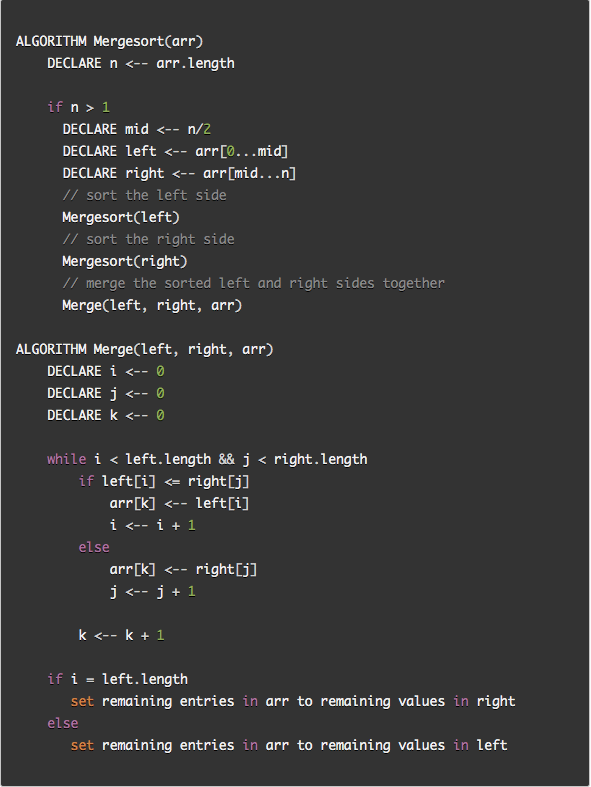
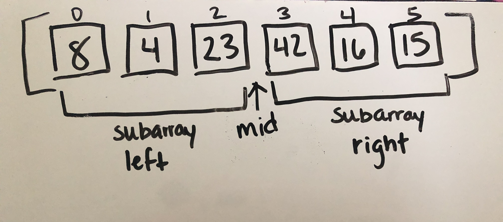
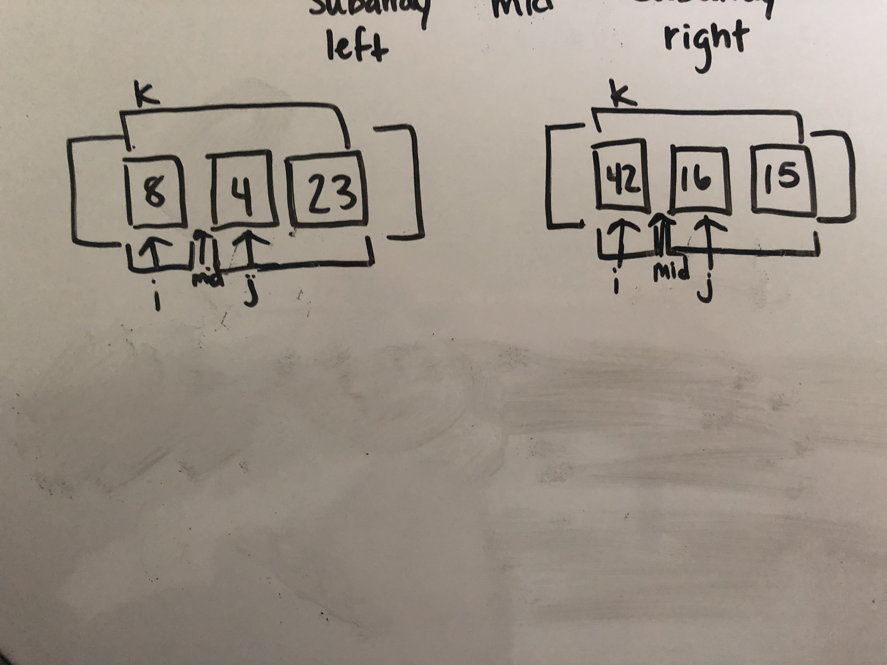
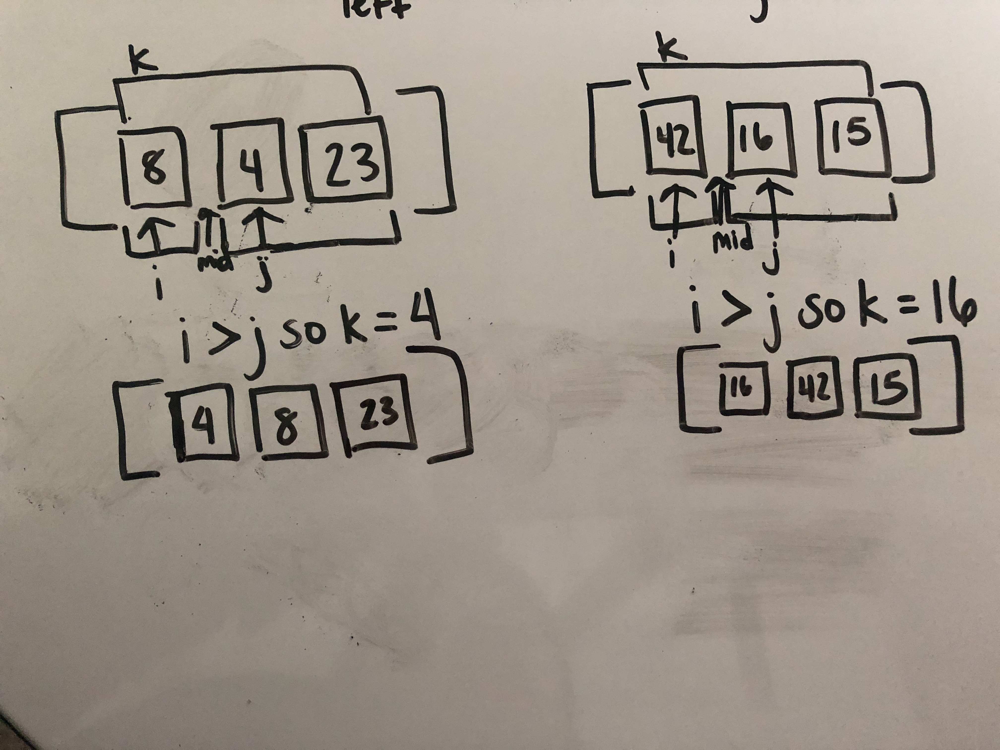
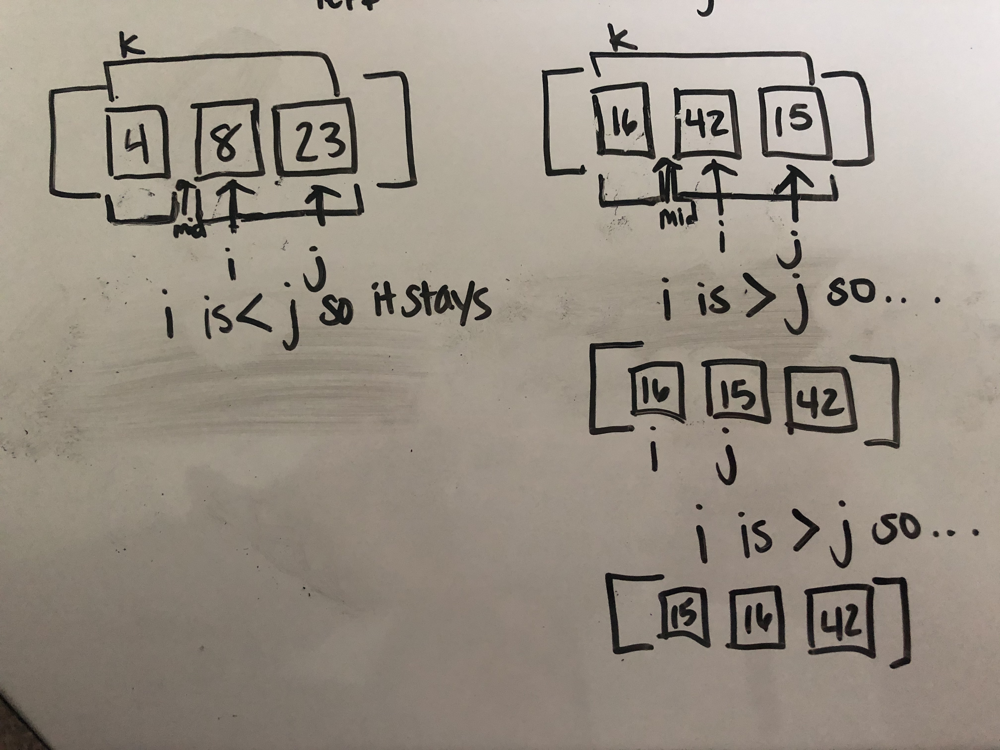
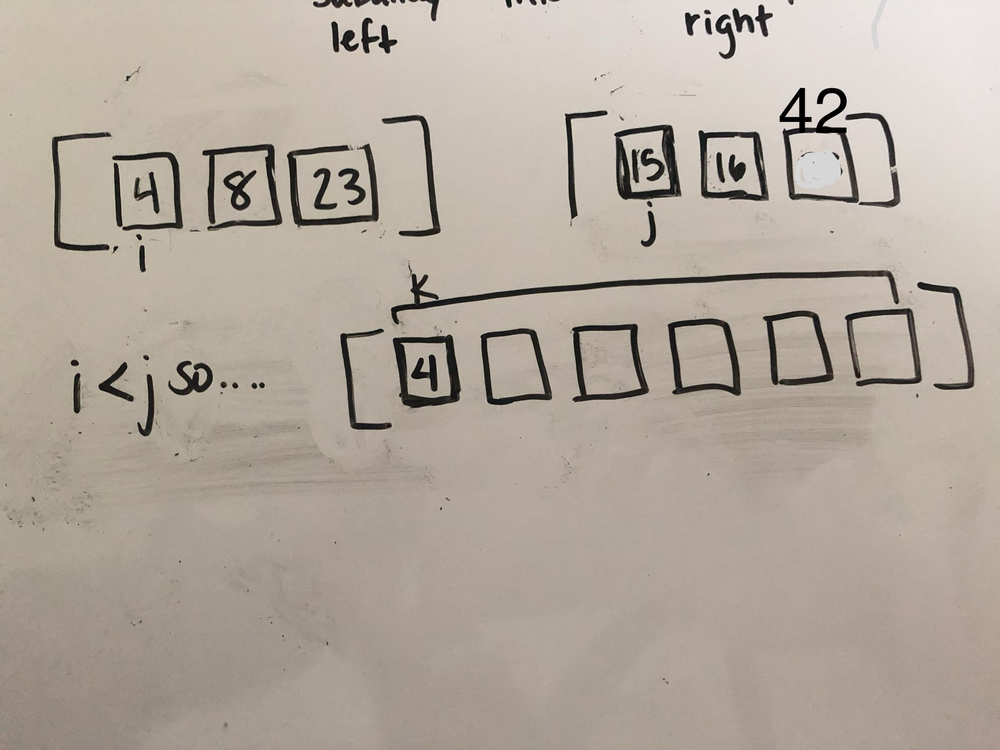
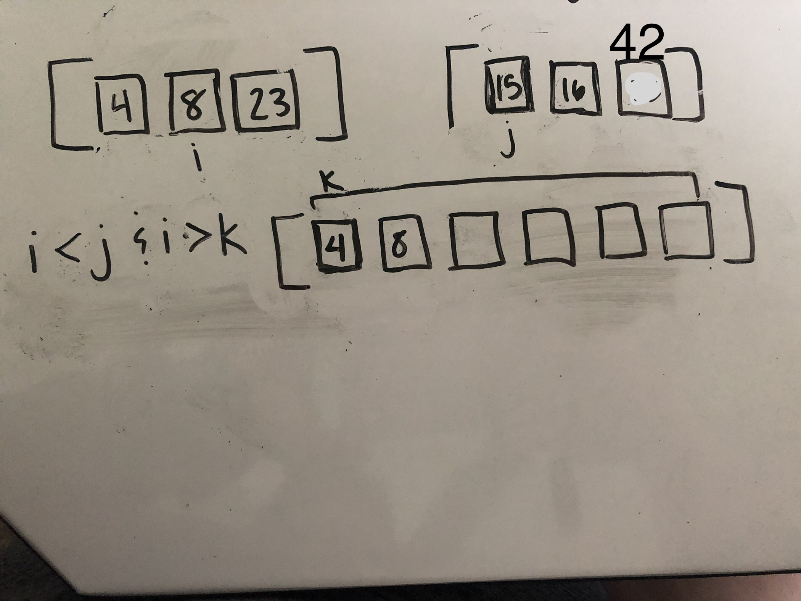
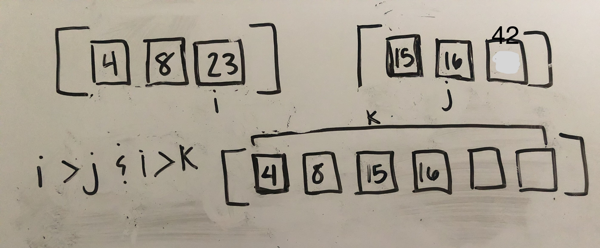
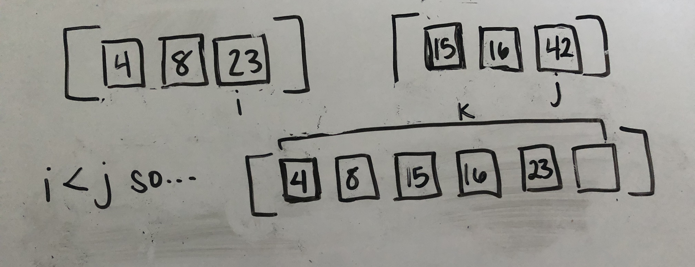
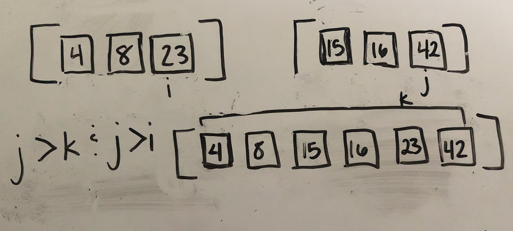

# Code Challenge 27: Merge Sort
Merge Sort implements a divide an conquer algorithm in which it recursively divides an array in two halves (subarrays) until the size becomes 1. Then, the subarrays are merged back together until the entire array has been merged. 

## Pseudocode

## Trace
Sample Array: [8, 4, 23, 42, 16, 15]

## Implementation
First, we find the midpoint of the array.

Then, we continue to find the midpoints of subarrays until the subarrays only contain 1 element.

Next, we sort all subarrays of 1 element and merge those results into subarrays of 2 elements.

Then, we merge the results into subarrays of 3 elements.

Next, we start to merge the subarrays of 3 back into a sorted array of 6 y comparing i and j to see which one is greater and then also comparing it with k, which is keeping track of our place in the array of 6.

In this pass, 8 is smaller than 15 but it is greater than 4 so we stick it into the next spot in the array of 6.

Again, we look at 23 and compare it with 15. Since 23 is greater than 15, we compare 15 with 8. Since it is greater than 8, we place it in the next spot to the right in the array of 6.

We look at 23 again and compare it now with 16. It is greater than 16 so then we compare 16 with 15. 16 is greater than 15 so we stick 16 to the right of 15.

Then we look at 23 again and compare it with 42. Since 23 is less than 42 and greater than 23, we put 23 to the right of 16. 

Since we cannot iterate through the left subarray anymore, we know that the remaining element, 42, must go to the right of 23. 

