# Code Challenge 28: Quick Sort
Quicksort is a divide and conquer sorting algorithm that works in place and is relatively efficient compared with some other sorting algorithms thus why it is called "Quick" sort. This algorithm divides an array into subarrays by its pivot point, and rearranges the elements so that all the elements that are less than or equal to the pivot are to its left, and the elements greater than the pivot are to its right. This is done recursively to all the subarrays. Once this process is done, the elements should all be in their sorted position. 

## Trace
Sample Array: [8, 4, 23, 42, 16, 15]

## Implementation
First, we start with our unsorted array and select the pivot.
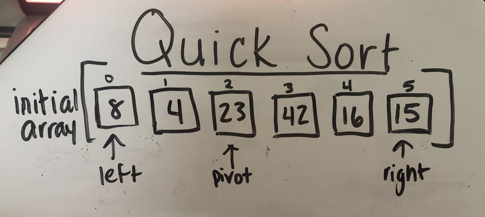

Second, we move the pivot to the end.
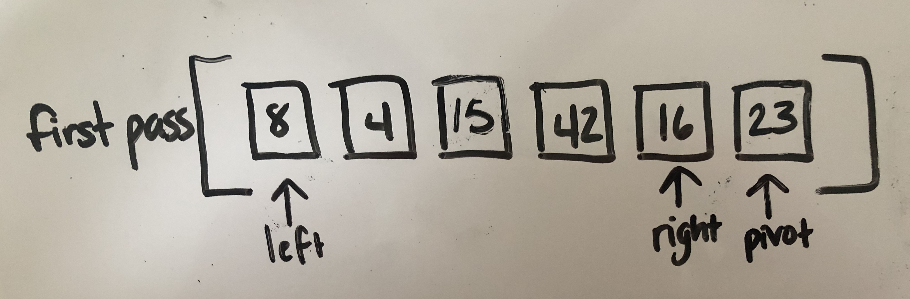

Then, we partition the subarray (index 0 until length -1) and move the left counter to the right until it finds a value greater than or equal to the pivot.
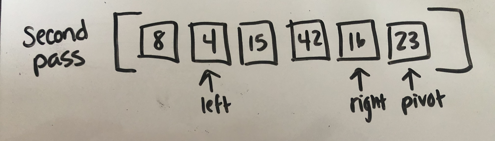
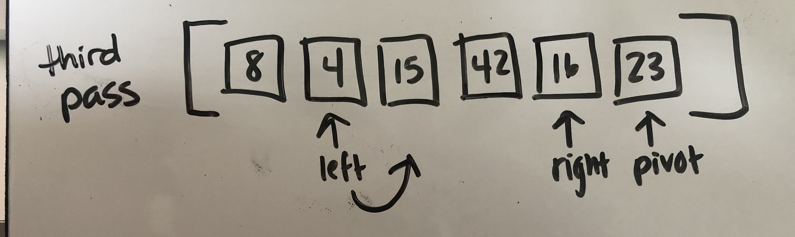
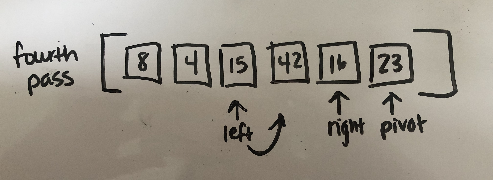

Next, the right counter moves left until it finds the left counter or a value less than the pivot. Since it immediately crosses the left boundary, left and right are swapped
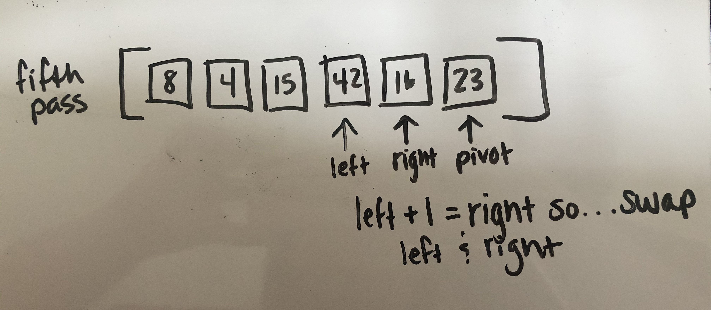

Then, we move the left counter to the right until it finds a value greater than or equal to the pivot. 
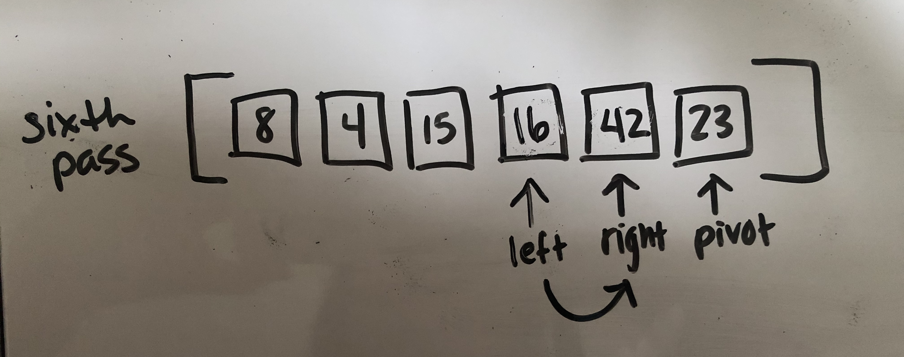

Since 42 is greater than 23, we stop there and move the right counter to the left until we encounter the left counter or find a value less than the pivot. Once we cross the left counter we know everything to the left of the left counter is less than the pivot and everything to the right is greater than or equal to the pivot, so then we swap left and pivot. 
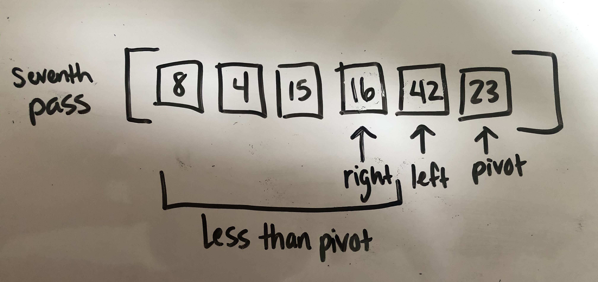

Then, we call Quicksort on the left subarray and select the pivot.
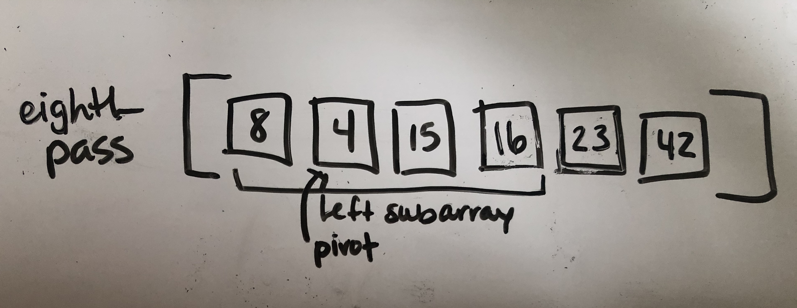

Next, we move the pivot to the end of the subarray and since the left counter is greater than the pivot we leave it in its place for now. Then we move the right counter until it encounters the left counter or until it finds a value less than the pivot.
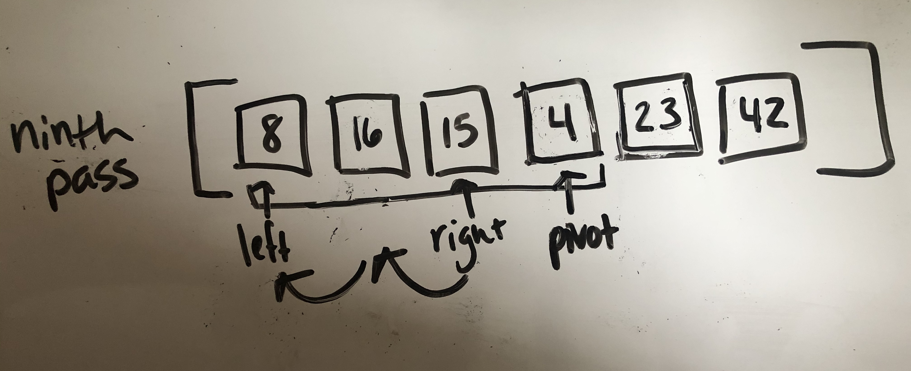

Since we know that the elements to the left of the left counter are less than the pivot and all the elements to the right are greater than or equal to the pivot, we swap 8 and 4.
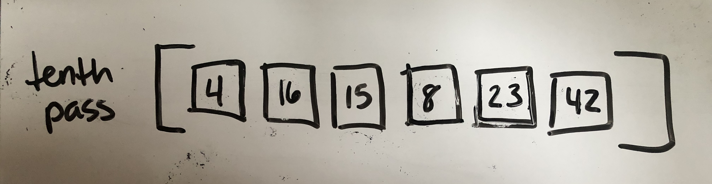

Next, we call Quicksort on the right subarray and select the pivot. We move the pivot to the end of the subarray.
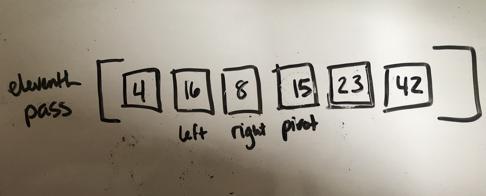

Then we move the left counter to the right until it finds a value greater than or equal to the pivot. Then we move the right counter until it encounters the left counter or finds a value less than the pivot. We then swap the left and right. 
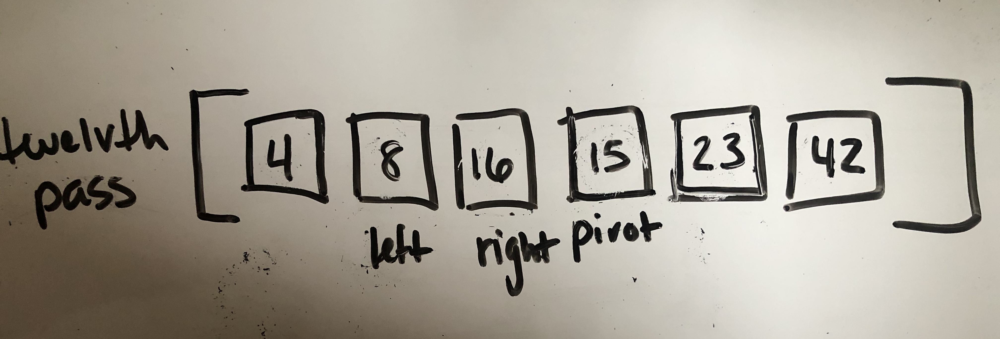

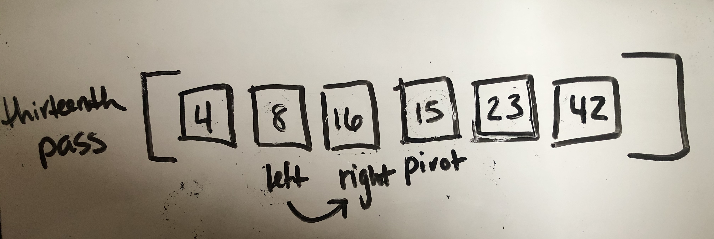

Then we move the left counter to the right until it finds a value greater than or equal to the pivot, and move the right counter until it encounters the left counter or finds a value less than the pivot.
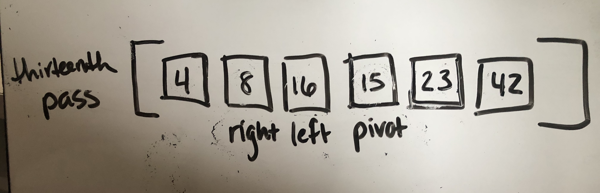

Since all the elements to the left of the left counter are less than the pivot and all the elements to the right are greater than or equal to the pivot, we swap 16 and 15 to move the pivot to its final spot. 
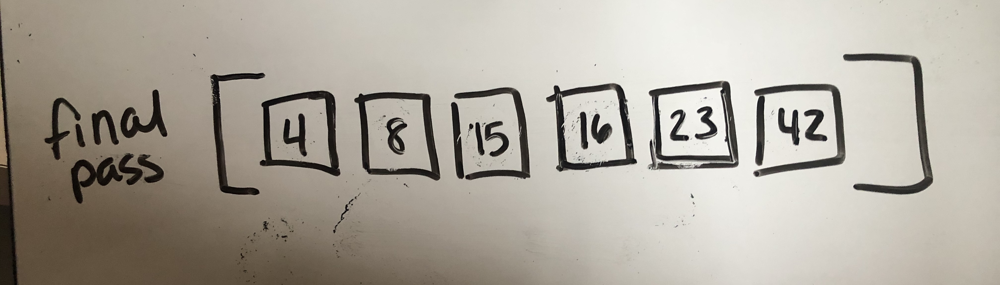
